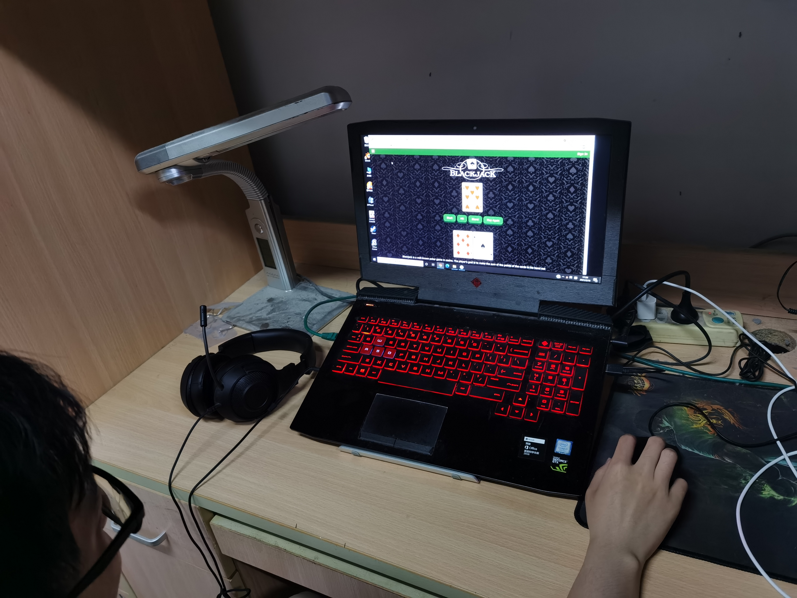
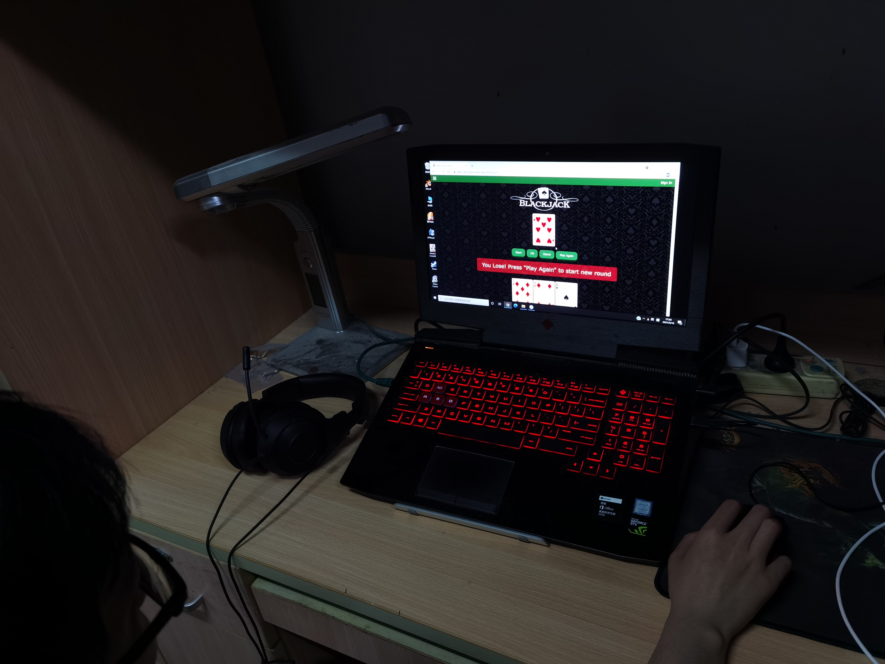
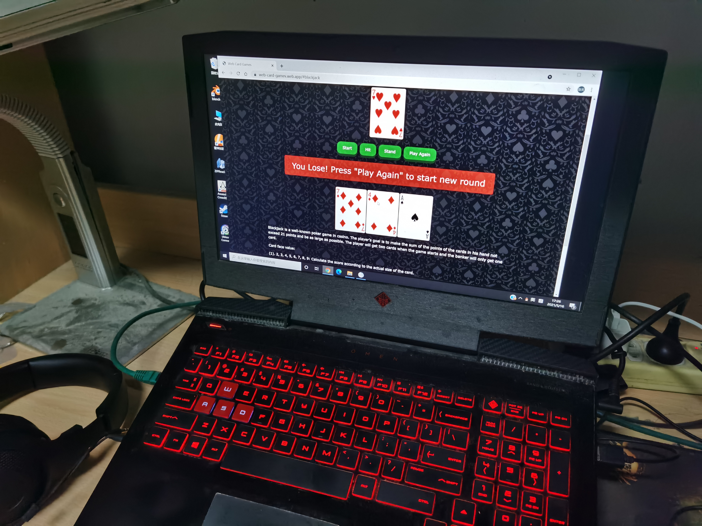
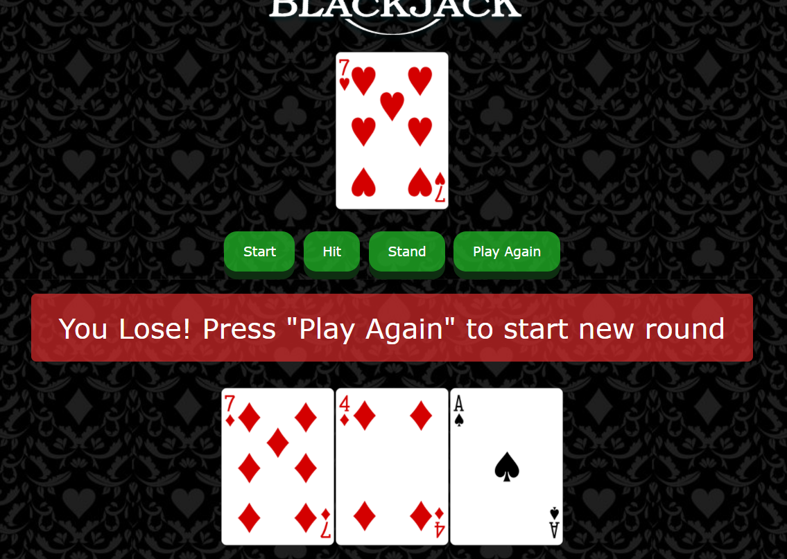

# WebCardGames
Web poker games collection: https://web-card-games.web.app

- [WebCardGames](#webcardgames)
  - [Project Introduction](#project-introduction)
  - [Project Structure](#project-structure)
  - [- assets (folder): contains images like the background](#--assets-folder-contains-images-like-the-background)
  - [Workload Distribution](#workload-distribution)
    - [Bosen Cheng](#bosen-cheng)
    - [Yating Liu](#yating-liu)
    - [Yifei Wang](#yifei-wang)
    - [Ziyu Tang](#ziyu-tang)
  - [User Evaluation](#user-evaluation)

## Project Introduction
Our project aims to provides players with several small games related to poker cards online. Players can learn and play different games on our website. Besides, we also hope to offer some interesting story about the game together with the game introduction.
We utilized a set of APIs that allow us to draw decks of poker cards, shuffle, and draw cards [Deck of Cards API](https://stackoverflow.com/questions/6957443/how-to-display-div-after-click-the-button-in-javascript). In 24 game, we use an additional api([24 Point Poker Game Calculator](https://helloacm.com/24/)) to provide sample solutions for users. In this project, we use Vue as the base of our MVP model. We mainly use w3.css to decorate our website, but some other effects that are not included in w3.css are manually written, such as the homepage title background, buttons and flippable card in 24 game, etc.

---
## Project Structure 
- index.html: display the content of the website from App
- js (folder):
    - apiConfig: store const values used for drawing data from the API
    - app.js: show the navigation bar and display different presenters
    - cardSource.js: fetch data from APIs
    - game24examSource.js: fetch data from APIs for 24 game
    - variable.js: store and pass the project variables to different files under one namespace. (To avoid the usage of global variable)
    - xxxModel.js: store different game models
    - views (folder):
        - xxxView.js: show the game components
    - firebase (folder):
        - firebaseConfig: basic firebase configuration file
        - userAuthen.js: allow user to sign up, sign in, and sign out with their emails and passwords
        - firebaseModel.js: store game data for user who has signed in
- vuejs (folder):
    - xxxPresenter: display and pass data to the corresponding View components
- assets (folder): contains images like the background 
---

**Notice:** 

- **Texas is still under construction, please check other pages for now**
1. To host the website locally, run "python -m http.server" in the "public" folder. Under local host condition, firebase is not usable due to the security rules of the realtime database.
2. For the persistence of our website, we only store the data for users who have signed in with their account. Currently, the website can only persist FreeCell game data. Of course, all content on this website is accessible without login.
3. Besides, for games like blackjack and 24Game, it is not necessary to store their in-game data since the round is very short, we will only store the data such as scores.
4. For breakout, it is a simple that used to test the realtime animation, thus the gaming logic is store in its view file and it is not related to poker card. After finish this game, we decided not to make realtime animation when using both API and MVP structure.   

---

## Workload Distribution 

### Bosen Cheng
**Current Stage**
1. Build up the homepage
2. Build the breakout game with poker cards
    - Well-designed layout 
    - Fun story about this game
3. Build the FreeCell game
    - Classic solitaire game
    - Players are able to withdraw their actions (achieved by an global variable LastGameState)
4. Sign up and sign in page
5. Sign up and sign in function, achieved using firebase authentication.
6. Persistence using firebase realtime database
    - Currently, persistence can only store freecell's game data.

### Yating Liu
**Current Stage**
1. Build 24 game
    - Implement a start page that give a brief introduction about the background and the rules of 24 game. An example is added to help the user understand how to play the game.
    - Implement a 24 game page with 4 views, 2 presenters, 2 api sources and 1 model. The 24 game page mainly has the following components:
        - A card that can flip when user hover over it, showing the solution that users give and the corresponding sample solution.
        - A calculator with a digital screen look, basic operators and functions that users might need. 
        - A row of cards that is drawed instantly after the user finish the last round.
        - A report that records all the cards, the user's solution, the sample solutions and the total score when the user finished all ten rounds.
3. Design overall style of the home page, navigation bar and 24 game with w3.css and muanually written css.
    - The home page title and its background in a russian roulette style.
    - The navigation bar and the pictures on it.
    - The digital screen, hoverable and flippable cards and the button animation.

### Yifei Wang
**Current Stage**
1. Build the blackjack game with poker cards
    - Well-designed layout
    - Introduction to this game
2. Create a fundamental level Ai robot in the game

###  Ziyu Tang
**Current Stage**
1. Completed most of the user interface in Texas, and completed part of the event. Since there is no part of ai, the web page is still not interactive

**Plan to do**
1. Complete the rule introduction interface and complete the settlement interface
2. Complete the remaining event

---
## User Evaluation

**Case Study 1**

 - Interviewer: Bosen Cheng
 - Interviewee: Mr. Ge, majored in Computer Science

I had a face-to-face user evaluation with him. Before the evaluation started, the only information I provided to him is the deployer website address, and I told him that this website is about poker card games.

In the beginning, he strolled around the home page. He noticed the sign-in button on the top right and said that he would sign up for a new account for this if this were an evaluation. He thought the function of the signup and sign-in pages works fine, but it feels not quite smooth. 

As he went through different pages and tried different games, he noted some problems that affected the user experience. The first one is a logic problem on Blackjack. According to the rule, the condition shown in the screenshot should not be considered as lose (This is fixed now). 

Besides, every time he clicked on the play again button, the page would be refreshed, which is strange (This is fixed now). Then on the Breakout page, the text color is not consistent. Sometimes it became black, making it hard to read (This is fixed, now all text on that page is white). Finally, it is not intuitive to click the "Close" button to close the navigation bar (We are working on it). He expected it to disappear once it jumps to another page or clicks anywhere on the web page apart from the navigation bar.

In the end, he said that the overall experience is satisfying as there are a lot of games to play, and there are some stories about the games. 
